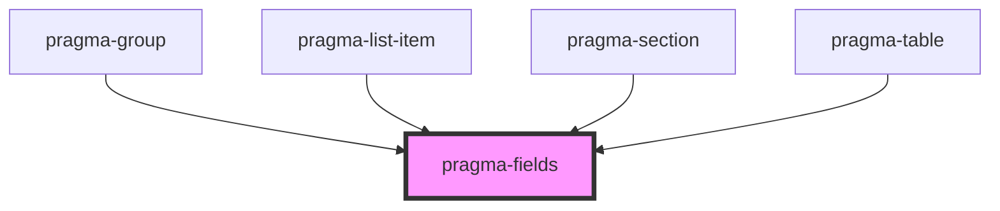

# pragma-fields

<!-- Auto Generated Below -->

## Properties

| Property | Attribute | Description                  | Type      | Default |
| -------- | --------- | ---------------------------- | --------- | ------- |
| `fields` | --        | The set of fields to render. | `Field[]` | `[]`    |

## Dependencies

### Used by

 - [pragma-group](../pragma-group)
 - [pragma-list-item](../pragma-list-item)
 - [pragma-section](../pragma-section)
 - [pragma-table](../pragma-table)

### Graph

----------------------------------------------

*Built with [StencilJS](https://stenciljs.com/)*
