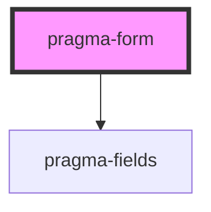

# pragma-form

<!-- Auto Generated Below -->

## Properties

| Property    | Attribute | Description                                   | Type                      | Default |
| ----------- | --------- | --------------------------------------------- | ------------------------- | ------- |
| `defaults`  | --        | Default properties for different field types. | `{ [key: string]: any; }` | `{}`    |
| `fields`    | --        | Pragma fields to maintain.                    | `Field[]`                 | `[]`    |
| `functions` | --        | Functions to provide to form expressions.     | `Function[]`              | `[]`    |
| `state`     | `state`   | Form state data.                              | `any`                     | `{}`    |

## Dependencies

### Depends on

- [pragma-fields](../pragma-fields)

### Graph

----------------------------------------------

*Built with [StencilJS](https://stenciljs.com/)*
