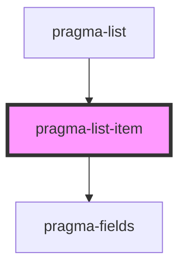

# pragma-list-item

<!-- Auto Generated Below -->

## Properties

| Property | Attribute | Description              | Type  | Default        |
| -------- | --------- | ------------------------ | ----- | -------------- |
| `field`  | `field`   | Pragma field definition. | `any` | `defaultField` |

## Dependencies

### Used by

 - [pragma-list](../pragma-list)

### Depends on

- [pragma-fields](../pragma-fields)

### Graph

----------------------------------------------

*Built with [StencilJS](https://stenciljs.com/)*
