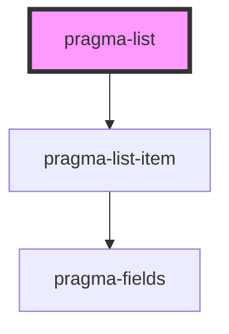

# pragma-list

<!-- Auto Generated Below -->

## Properties

| Property    | Attribute    | Description                       | Type      | Default        |
| ----------- | ------------ | --------------------------------- | --------- | -------------- |
| `disabled`  | `disabled`   | Whether the field is disabled.    | `boolean` | `false`        |
| `field`     | `field`      | Pragma field definition.          | `any`     | `defaultField` |
| `label`     | `label`      | The field's label.                | `string`  | `undefined`    |
| `path`      | `path`       | The field's path.                 | `string`  | `undefined`    |
| `showLabel` | `show-label` | Whether to show the list's label. | `boolean` | `false`        |

## Dependencies

### Depends on

- [pragma-list-item](../pragma-list-item)

### Graph

----------------------------------------------

*Built with [StencilJS](https://stenciljs.com/)*
