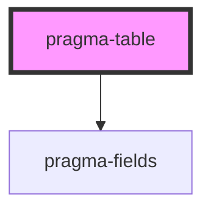

# pragma-table

<!-- Auto Generated Below -->

## Properties

| Property   | Attribute  | Description                    | Type      | Default        |
| ---------- | ---------- | ------------------------------ | --------- | -------------- |
| `disabled` | `disabled` | Whether the field is disabled. | `boolean` | `false`        |
| `field`    | `field`    | Pragma field definition.       | `any`     | `defaultField` |
| `label`    | `label`    | The field's label.             | `string`  | `undefined`    |
| `path`     | `path`     | The field's path.              | `string`  | `undefined`    |

## Dependencies

### Depends on

- [pragma-fields](../pragma-fields)

### Graph

----------------------------------------------

*Built with [StencilJS](https://stenciljs.com/)*
