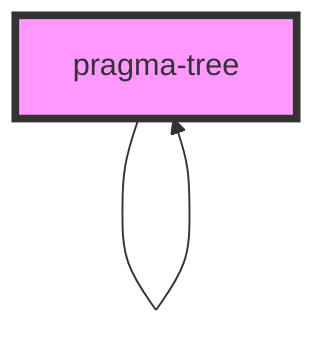

# pragma-tree

<!-- Auto Generated Below -->

## Properties

| Property | Attribute | Description                                | Type    | Default     |
| -------- | --------- | ------------------------------------------ | ------- | ----------- |
| `fields` | --        | The children of the root node of the tree. | `any[]` | `undefined` |

## Dependencies

### Used by

 - [pragma-tree]()

### Depends on

- [pragma-tree]()

### Graph

----------------------------------------------

*Built with [StencilJS](https://stenciljs.com/)*
