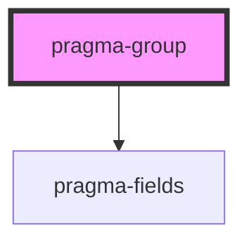

# pragma-group

<!-- Auto Generated Below -->

## Properties

| Property    | Attribute    | Description                        | Type      | Default        |
| ----------- | ------------ | ---------------------------------- | --------- | -------------- |
| `field`     | `field`      | Pragma field definition.           | `any`     | `defaultField` |
| `hideLabel` | `hide-label` | Whether to hide the field's label. | `boolean` | `false`        |
| `label`     | `label`      | The field's label.                 | `string`  | `undefined`    |
| `path`      | `path`       | The field's path.                  | `string`  | `undefined`    |

## Slots

| Slot | Description    |
| ---- | -------------- |
|      | Group content. |

## Dependencies

### Depends on

- [pragma-fields](../pragma-fields)

### Graph

----------------------------------------------

*Built with [StencilJS](https://stenciljs.com/)*
