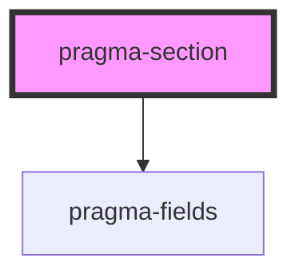

# pragma-section

<!-- Auto Generated Below -->

## Properties

| Property | Attribute | Description | Type  | Default |
| -------- | --------- | ----------- | ----- | ------- |
| `field`  | `field`   |             | `any` | `{}`    |

## Slots

| Slot | Description      |
| ---- | ---------------- |
|      | Section content. |

## Dependencies

### Depends on

- [pragma-fields](../pragma-fields)

### Graph

----------------------------------------------

*Built with [StencilJS](https://stenciljs.com/)*
